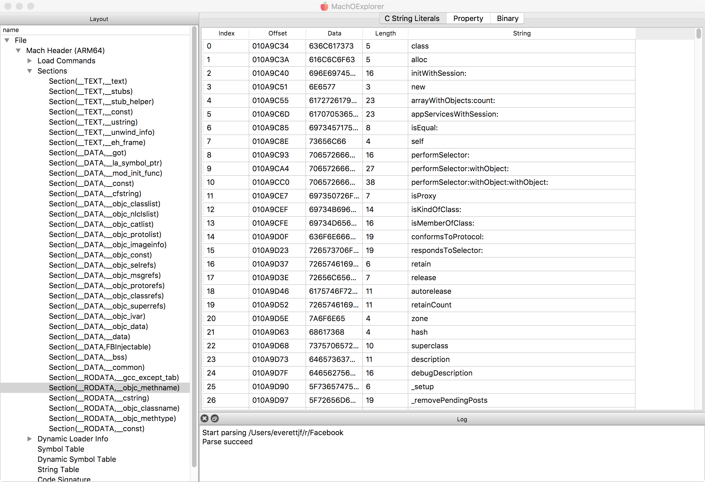

# MachOExplorer

> A modern Mach-O and Archive (`.a`) explorer built with Qt.
>
> Language: **English** | [简体中文](README.zh-CN.md)


[](LICENSE)

## Install

### macOS
- GitHub Release: https://github.com/everettjf/MachOExplorer/releases/latest
- Homebrew:
```bash
brew update && brew tap everettjf/homebrew-tap && brew install --cask machoexplorer
```

### Windows
- Build an installer with Inno Setup (step-by-step in `docs/release_packaging.md`).
- Included scripts:
  - `packaging/windows/MachOExplorer.iss`
  - `scripts/build_windows_installer.ps1`

## Update Checks
- `Help -> Check for Updates`
- Startup auto-check is enabled.
- When a new version is found, users can choose:
  - `Download`
  - `Remind in 7 days`
  - `Remind in 30 days`
  - `Later`
- Download is guided to GitHub Releases.

## What It Can Do
- Parse and inspect Mach-O, Fat Mach-O, and Unix Archive (`.a`) containers.
- Inspect load commands, sections, symbols, string tables, relocation tables, and dyld info.
- Disassemble `__TEXT,__text` with optional Capstone integration and symbol association.
- Build instruction-level xref/callgraph data, including register-based indirect call/jump tracking.
- Decode modern dyld data for `LC_DYLD_EXPORTS_TRIE` and `LC_DYLD_CHAINED_FIXUPS`.
- Explore ObjC2 metadata trees (classes/categories/protocols/methods/properties).
- Inspect Swift metadata sections (`__swift5_*`) with semantic graph edges and field-record decoding.
- Attach by PID on macOS (path-based workflow) to inspect the target executable.
- Extract dyld shared cache images and open directly (menu workflow + double-click from `Images` table).
- Switch theme mode: `Follow System`, `Light`, `Dark`.
- Table workflow enhancements: auto-select first row, `Cmd/Ctrl+F` filter, `Esc` or `Clear` to reset filter, `Cmd/Ctrl+C` copy selected row, `Cmd/Ctrl+Shift+C` copy all visible rows.

## Screenshot


## Supported Commands (Selected)
- `LC_SEGMENT`, `LC_SEGMENT_64`
- `LC_SYMTAB`, `LC_DYSYMTAB`, `LC_TWOLEVEL_HINTS`
- `LC_LOAD_DYLIB`, `LC_ID_DYLIB`, `LC_LOAD_WEAK_DYLIB`, `LC_REEXPORT_DYLIB`, `LC_LAZY_LOAD_DYLIB`, `LC_LOAD_UPWARD_DYLIB`
- `LC_LOAD_DYLINKER`, `LC_ID_DYLINKER`, `LC_DYLD_ENVIRONMENT`
- `LC_DYLD_INFO`, `LC_DYLD_INFO_ONLY`
- `LC_DYLD_EXPORTS_TRIE`, `LC_DYLD_CHAINED_FIXUPS`
- `LC_RPATH`, `LC_MAIN`, `LC_UUID`, `LC_SOURCE_VERSION`
- `LC_VERSION_MIN_*`, `LC_BUILD_VERSION`
- `LC_CODE_SIGNATURE`, `LC_SEGMENT_SPLIT_INFO`, `LC_FUNCTION_STARTS`, `LC_DATA_IN_CODE`, `LC_DYLIB_CODE_SIGN_DRS`, `LC_LINKER_OPTIMIZATION_HINT`
- `LC_NOTE`, `LC_LINKER_OPTION`, `LC_FILESET_ENTRY`

## Build

### Prerequisites
- CMake `>= 3.16`
- Qt 6 (recommended) or Qt 5 with `Core/Gui/Widgets/Network`
- C++14 compiler

### macOS (CMake)
```bash
cmake -S src -B build -DCMAKE_BUILD_TYPE=Release -DCMAKE_PREFIX_PATH="/Users/eevv/Qt/6.10.2/macos"
cmake --build build -j8
./build/MachOExplorer
```

### Windows (CMake)
```powershell
cmake -S src -B build -DCMAKE_BUILD_TYPE=Release -DCMAKE_PREFIX_PATH="C:/Qt/6.x.x/msvcXXXX_64"
cmake --build build --config Release
```

### Packaging
- macOS/Homebrew cask + Windows installer notes: `docs/release_packaging.md`

### Optional: Capstone Disassembly Backend
Capstone is optional. If detected by CMake, `__TEXT,__text` disassembly is enabled automatically.

## Dyld Shared Cache Tools
```bash
# list images
./build/moex-cache-list /path/to/dyld_shared_cache_arm64e | head -50

# list as JSON with exact match and limit
./build/moex-cache-list --json --exact --limit=20 /path/to/dyld_shared_cache_arm64e /usr/lib/libobjc.A.dylib

# extract one image with compact file layout (recommended)
./build/moex-cache-extract --compact /path/to/dyld_shared_cache_arm64e libswiftCore.dylib /tmp/libswiftCore.extracted.macho

# exact-match extraction (avoid substring ambiguity)
./build/moex-cache-extract --compact --exact /path/to/dyld_shared_cache_arm64e /usr/lib/libobjc.A.dylib /tmp/libobjc.extracted.macho

# extract all matched images to a directory
mkdir -p /tmp/moex-cache-batch
./build/moex-cache-extract --compact --all /path/to/dyld_shared_cache_arm64e libswift /tmp/moex-cache-batch
# (--all will create the output directory if it does not exist)

# preview planned extraction without writing files
./build/moex-cache-extract --compact --all --dry-run /path/to/dyld_shared_cache_arm64e libswift /tmp/moex-cache-batch

# cap batch extraction count
./build/moex-cache-extract --compact --all --max=5 /path/to/dyld_shared_cache_arm64e libswift /tmp/moex-cache-batch
```

Tool quick reference:
- `moex-cache-list --help`
- `moex-cache-list --json --exact --limit=N --output=<file> <cache> <filter>`
- `moex-cache-extract --help`
- `moex-cache-extract --compact --exact <cache> <image> <out>`
- `moex-cache-extract --compact --all [--max=N] [--dry-run] <cache> <filter> <out-dir>`
- `moex-cache-extract --json --compact --all --dry-run <cache> <filter> <out-dir>`

## Parser Regression / Fuzz

### Crash Regression Runner
```bash
cmake -S src -B build -DCMAKE_PREFIX_PATH="/Users/eevv/Qt/6.10.2/macos"
cmake --build build -j8
tests/regression/run_all.sh
```

### Build Fuzz Target (Clang)
```bash
cmake -S src -B build-fuzz -DMOEX_ENABLE_FUZZ=ON -DCMAKE_CXX_COMPILER=clang++ -DCMAKE_C_COMPILER=clang
cmake --build build-fuzz -j8
./build-fuzz/moex-fuzz-parse
```

## Included Samples
- `sample/simple`
- `sample/complex`
- `sample/simple.c`

## Project Layout
- `src/libmoex/`: parser and view-node model
- `src/src/`: Qt UI and controllers
- `src/tools/moex_parse_main.cpp`: parser CLI for crash-regression
- `src/fuzz/fuzz_macho_parse.cpp`: fuzz target
- `tests/regression/`: regression cases and runner
- `sample/`: sample binaries
- `image/`: screenshots/icons for docs

## Version Notes
- 2026-03-09 — `v2.0.0`: consolidated v2 major release (all v2.x improvements included).
  - Platform/build modernization: Qt6-friendly build flow, theme system (`Follow System` / `Light` / `Dark`), and release packaging scripts.
  - Format coverage: stronger Mach-O / Fat / `.a` archive parsing, deeper relocation display, ObjC metadata tree improvements, and richer Swift metadata (`__swift5_*`) semantic graphing.
  - Disassembly and xref: Capstone-backed `__TEXT,__text` browsing, function-level call graph summary, and deeper ARM64/x86 indirect call/jump data-flow tracking.
  - Dyld shared cache: cache image listing/extraction tools, JSON modes, dry-run/batch options, GUI extract-and-open workflow, and double-click drill-in from image tables.
  - Process analysis: attach-by-PID workflows on macOS (path and memory snapshot modes where supported).
  - Usability upgrades: live table filter (debounced), clear/reset controls, CSV export, row copy and copy-all-visible shortcuts, keyboard navigation sync, sorting, and better status feedback.
  - Update experience: startup update check via GitHub releases, `Check for Updates` menu, remind options (`7 days` / `30 days`), and one-click release download guidance.
  - Stability/security: stricter parser boundary checks (archive/dyld), safer extraction lifecycle (async/cancel/timeout/temp cleanup/output validation), expanded malformed-input crash regression suite, and fuzz/regression tooling.

## Contributing
Issues and PRs are welcome:
- Project: https://github.com/everettjf/MachOExplorer
- Issues: https://github.com/everettjf/MachOExplorer/issues

## Acknowledgements
- Inspiration: MachOView
- Icon by [wantline](https://weibo.com/wantline)

## License
MIT. See [LICENSE](LICENSE).

## Star History
[](https://star-history.com/#everettjf/MachOExplorer&Date)
